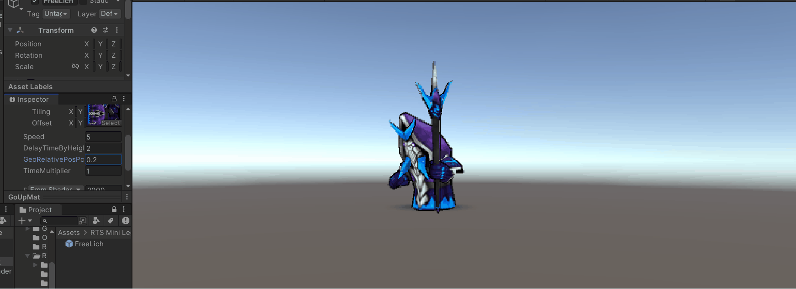

# Unity-Miscellaneous-Shaders
A warehouse for managing small shaders, added slowly.

## Update 2018/1/1 GlassDragon
#### Description:
run

## Update 2017/12/3：Explosion and sand effect
#### Description:

run and click the model

Blog:

[Using the geometry shader to achieve model explosion effect
](https://medium.com/@chen_jd/using-the-geometry-shader-to-achieve-model-explosion-effect-cf6d5ec03020)

## Update 2024/22/05：Fade effect
#### Description:

run and click the model

## Update 2017/11/23: Update a demo of Stanford rabbit generating fur
#### Description:
Using the Geometry Shader to generate fur on GPU.

## Update 2017/11/23: Update a small demo of the effect of snow marks.

## Small essay: Write a stroke effect based on geometric generation method

## 0x00 Preface
After entering the golden autumn of September, I participated in more community activities on weekends. Therefore, I don’t have enough time to write some long articles as before. When I was thinking about writing something, I suddenly thought of the previous article ["Using GPU to achieve page turning effect"] (https://zhuanlan.zhihu.com /p/28836892) uses shader to achieve an interesting book-turning effect. So this article might as well follow the example of writing a shader to achieve a certain effect, but it may be shorter in length and simpler in effect. Of course, the writing time is also more fragmented, so "Small Essay" seems to be a good one title.

## 0x01 Let’s start with some theoretical knowledge
What this article wants to achieve is a very common stroke effect. 
(The model of this article comes from: RTS Mini Legion Lich)
The idea of ​​implementation comes from the relevant chapters of "Real Time Rendering", that is, strokes based on geometric generation methods. The relevant theoretical content has been mentioned in many articles. Here is a brief overview: two passes are used when drawing the model. The first pass draws the model normally; the second pass requires the front side of the model to be eliminated— -The reason for frontal culling. I will tell you the reason in the following demonstration - then modify the vertex position in vs, expand the vertex by a certain distance along the normal direction, and then output the model in solid color in fs.

(Picture from: [Translation] The secret of "real-time 3D graphics of pure cartoon animation" realized in "Experimental Game Graphics" "GUILTY GEAR Xrd -SIGN-" by Zenji Nishikawa, Part 1 (2))
## 0x02 Let’s do some more practical operations
Okay, now let's implement this effect.
First of all, we obviously need two passes in total, but we first implement one pass to draw the model normally.

// The first pass is used to render the normal model
Pass
{
CGPROGRAM
#pragma vertex vert
#pragma fragment fragment
			
#include "UnityCG.cginc"

struct appdata
{
float4 vertex : POSITION;
float2 uv : TEXCOORD0;
};

struct v2f
{
float2 uv : TEXCOORD0;
float4 vertex : SV_POSITION;
};

sampler2D _MainTex;
float4 _MainTex_ST;
			
v2f vert (appdata v)
{
v2f o;
o.vertex = UnityObjectToClipPos(v.vertex);
o.uv = TRANSFORM_TEX(v.uv, _MainTex);
return o;
}
			
fixed4 frag (v2f i) : SV_Target
{
fixed4 col = tex2D(_MainTex, i.uv);
return col;
}
ENDCG
		
After this drawing, a normal model appears on the screen.

OK, the second pass is coming.
Since we need to use normal information this time, we can directly use Unity's built-in appdata_base as the input of vs, which contains the normal information of the vertices. Since there is no data transfer between vs and fs this time, vs only needs to output the position to SV_POSITION, and fs only needs to output the solid color to SV_Target.

float4 vert(appdata_base v) : SV_POSITION
{
...
}

fixed4 frag() : SV_Target {
return _OutlineColor;
}

In addition, in VS we cannot directly use the normal information in the model space, so we have to convert the normal information of the vertices from the model space to the clip space.

float3 normal = mul((float3x3) UNITY_MATRIX_MVP, v.normal);

Then expand the vertices a certain distance along the normal direction:

pos.xy += _OutlineFactor * normal.xy;

Um. The effect now is quite impressive.

Finally, let’s take a look at why front-facing culling should be turned on. Without front-facing culling, what we will see is a model with the wrong color.
Like this:

Okay, now a common and simple effect has been achieved.
Good morning to everyone~